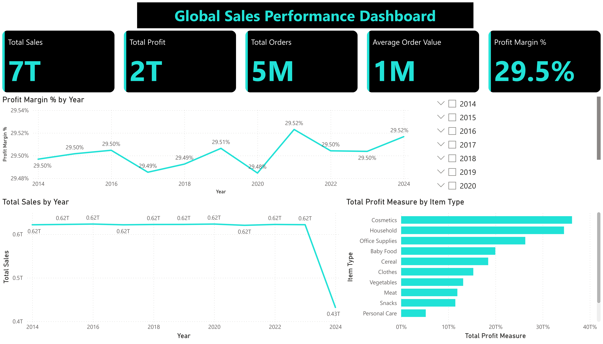

# 🧠 Elevate Labs - Task 3: Data Storytelling and Visual Reporting

🔗 **[View Live Power BI Dashboard](https://app.powerbi.com/groups/me/reports/5d19096d-1563-4409-9b6d-56a9f0c0cbd7/ee8ac30ed92a4e400079?experience=power-bi)**

## 📊 Objective
To create a compelling Power BI dashboard that offers meaningful insights into the sales performance of a fictional retail business using the Sample Sales Data (5 Million Transactions) from Kaggle.

---

## 📁 Files

- `dashboard.pbix` – 📂 (Not uploaded here due to GitHub's 100MB file limit. View via the [Live Dashboard](https://app.powerbi.com/groups/me/reports/5d19096d-1563-4409-9b6d-56a9f0c0cbd7/ee8ac30ed92a4e400079?experience=power-bi))
- `Task 3.pptx` – 📽️ Slide deck summarizing the project
- `sales.csv` – 📈 Source dataset used in Power BI
- `screenshots/` – 📸 Folder containing snapshot images of the dashboard

---

## 📌 Key Metrics Tracked

1. **Total Sales** – Full form value in ₹ (Indian Rupees), e.g. ₹12.5 Million
2. **Total Profit** – Complete profit earned, calculated from sales
3. **Profit Growth** – Percentage change across time periods

---

## 🎯 Dashboard Highlights

- 💡 Insightful KPIs with summary cards
- 📅 Time-series analysis using slicers
- 🌍 Regional sales distribution (Removed in this version)
- 📦 Product and category-wise breakdown
- 📊 Fully interactive visuals and filters

---

## 🖼️ Sample Screenshots

Below are embedded snapshots of the dashboard:

> *(More available in the `screenshots` folder)*

---

## 🚫 Note
The `.pbix` file is larger than 100MB and could not be uploaded directly to this repository. Please use the **live link** above to interact with the dashboard.

---

